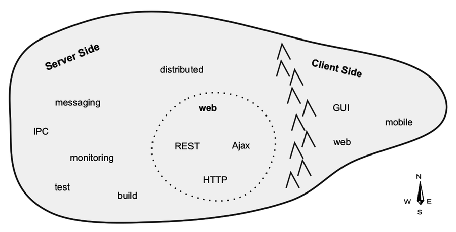
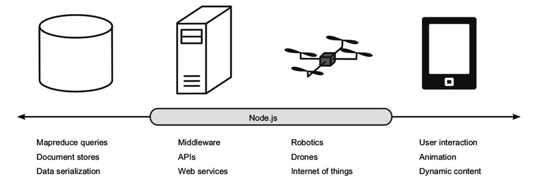

# Nodejs 8 The Right Way - Practical Server Side JavaScript That Scales (2018)

# Chapter 01 - Getting Up to Speed on Node.js 8

* Client Server
  
* Where does Node.js fits in:
  

* JS is utilized heavily in:
  * MongoDB
  * CouchDB
* JSON utilized heavily in:
  * Elasticsearch
  * Neo4j
* NodeJS also working on:
  * Raspberry Pi (hardware)
  * Tessel (hardware)
  * Johnny-Five (api)
  * CylonJS (api)

## NodeJS Principles
* As NodeJS developer your job is to create the callback functions.
* NodeJS is an event-driven programming

### Event Loop
An event loop allows quick dispatching of operations when events are triggered.

* NodeJS couples JS  with an event loop.
* NodeJS provides low level event loop access.
* NodeJS event loop is written in C.
* When an event is triggered, event handlers (callbacks) are invoked.
* N callback functions can answer to an event.
* Only 1 callback function will be executing at any time.
* Only 1 line of code will be executing at any time.

### Single-Threaded
* NodeJS is a single threaded environment.
* Utilizes nonblocking APIs techniques to achieve the sense of parallelism (multithreading)

# Chapter 02 - Wrangling The File System

### Syntax
* `use strict` Recommended since ES5
  * Disables problematic JS features
  * Makes some JS features throw Exceptions
* `const` constant variable must'n change value otherwise runtime error.
* `require()` pulls/calls a Node.js module (similar to import/#include)
  * returns plain JS object
  * returns a function 
* `process.argv` array containing argument vector. command line call utilized

#### Arrow function expression
```javascript

(param1, param2) => console.log('');

```
* Recommended Since ES2015
* Recommended for callbacks
* Doesn't create a new scope for `this`

#### Template Strings
```javascript

`String with 
 multiple lines
 and ${expressions}`

```
* Support expression interpolation. Meaning expressions are evaluated

# Chapter 03 - Networking With Sockets

# Chapter 04 - Connecting Robust Microservices